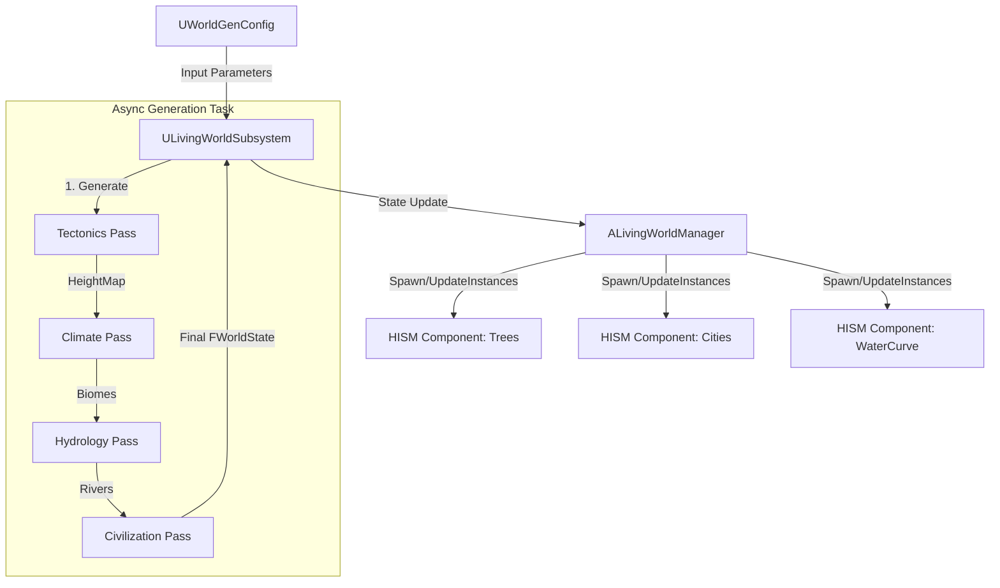

# Living World Procedural Generation Spec

## 1. Context
* **Summary:** This system implements a layered procedural generation pipeline that simulates geological and climatic processes to create a believable fantasy world. It operates in four distinct passes: Tectonics (Landform), Climate (Atmosphere), Hydrology (Water flow), and Civilization (Settlement placement).
* **Core Loop Utility:** This system creates the fundamental "Game Board" upon which all exploration, resource gathering, and territorial control gameplay occurs.
* **Data Strategy:** 
    *   **Pure Data Simulation:** The generation process MUST NOT spawn Actors. It will operate entirely on **Structure of Arrays (SoA)** buffers (e.g., `TArray<float>` for Height, `TArray<FVector>` for flow) to maximize cache efficiency and enable `ParallelFor` multi-threading. 
    *   **HISM Visualization:** The visual representation (trees, rocks, cities) will be handled by **Hierarchical Instanced Static Meshes (HISM)** or PCG framework components, avoiding the overhead of thousands of `AActor` instances.
    *   **Graph/Grid Hybrid:** We will use a dense Grid for terrain/climate (SoA) and a sparse Graph for river/road networks (`TArray<FNode>`).

## 2. Data Contract

### A. Configuration (`UWorldGenConfig`)
*   **Base Class:** `UDataAsset`
*   **Purpose:** Defines the rules and constraints for the world generation steps.
*   **Asset Hygiene:** All visual references MUST use `TSoftObjectPtr`.
*   **PCG Integration:** We will use **PCG Attribute Sets** to feed `FWorldState` data (Height, Biome, RiverMask) into a PCG Graph for efficient scattering of trees and rocks, replacing manual HISM management where possible.

```cpp
USTRUCT(BlueprintType)
struct FTectonicsConfig
{
    GENERATED_BODY()
    
    UPROPERTY(EditAnywhere, meta=(ClampMin=2))
    int32 PlateCount = 12;

    UPROPERTY(EditAnywhere, meta=(ClampMin=0.0, ClampMax=1.0))
    float OceanPercentage = 0.6f;

    UPROPERTY(EditAnywhere, meta=(ToolTip="0.0 = Static, 1.0 = Fast Drift"))
    float PlateVelocityVariance = 0.5f;
    
    UPROPERTY(EditAnywhere, meta=(ToolTip="Height multiplier for plate collisions"))
    float FoldingStrength = 1.0f;
};

USTRUCT(BlueprintType)
struct FClimateConfig
{
    GENERATED_BODY()

    UPROPERTY(EditAnywhere, meta=(ToolTip="Simulates Coriolis effect strength"))
    float PlanetRotationSpeed = 1.0f;

    UPROPERTY(EditAnywhere)
    float GlobalRainfall = 1.0f;

    UPROPERTY(EditAnywhere, meta=(ToolTip="How much moisture is lost when crossing mountains"))
    float RainShadowStrength = 0.8f;
};

USTRUCT(BlueprintType)
struct FHydrologyConfig
{
    GENERATED_BODY()

    UPROPERTY(EditAnywhere)
    float RiverErosionRate = 0.05f;

    UPROPERTY(EditAnywhere, meta=(ToolTip="Threshold for merging streams"))
    float ConfluenceThreshold = 10.0f;
};

USTRUCT(BlueprintType)
struct FCivilizationConfig
{
    GENERATED_BODY()

    UPROPERTY(EditAnywhere, meta=(ClampMin=0, ClampMax=100))
    int32 TargetCityCount = 20;

    UPROPERTY(EditAnywhere)
    float TradeRouteSearchRadius = 5000.0f; // World Units
};

USTRUCT(BlueprintType)
struct FBiomeAssetDefinition
{
    GENERATED_BODY()

    UPROPERTY(EditAnywhere)
    FName BiomeName;

    // SOFT pointer to avoid loading the mesh just to read config
    UPROPERTY(EditAnywhere)
    TSoftObjectPtr<UStaticMesh> GroundMesh;
    
    UPROPERTY(EditAnywhere)
    TArray<TSoftObjectPtr<UStaticMesh>> FoliageTypes;
};

UCLASS()
class UWorldGenConfig : public UDataAsset
{
    GENERATED_BODY()

public:
    UPROPERTY(EditAnywhere, Category = "Layer 1: Tectonics")
    FTectonicsConfig Tectonics;

    UPROPERTY(EditAnywhere, Category = "Layer 2: Climate")
    FClimateConfig Climate;

    UPROPERTY(EditAnywhere, Category = "Layer 3: Hydrology")
    FHydrologyConfig Hydrology;

    UPROPERTY(EditAnywhere, Category = "Layer 4: Civilization")
    FCivilizationConfig Civilization;
    
    UPROPERTY(EditAnywhere, Category = "Layer 4: Naming")
    UDataTable* SettlementNameTable; // Col 1: Prefix, Col 2: Suffix, Col 3: TypeTag

    UPROPERTY(EditAnywhere, Category = "Assets")
    TArray<FBiomeAssetDefinition> Biomes;
};
```

### B. Runtime State (`FWorldState`)
*   **Purpose:** Holds the raw data of the generated world.
*   **Architecture:** **Structure of Arrays (SoA)**. We do NOT use an array of `FCell` structs because we often process layers independently (e.g., eroding the `HeightMap` does not require reading the `CivilizationMap`).

UENUM(BlueprintType)
enum class EPlateType : uint8
{
    Oceanic,
    Continental
};

```cpp
USTRUCT(BlueprintType)
struct FWorldState
{
    GENERATED_BODY()

    // Grid Dimensions
    int32 Width;
    int32 Height;

    // --- Layer 1 & 2: Terrain Data (SoA) ---
    // Contiguous memory for fast erosion/hydraulic simulation
    UPROPERTY()
    TArray<float> HeightMap;

    UPROPERTY()
    TArray<float> TemperatureMap;

    UPROPERTY()
    TArray<float> MoistureMap;
    
    UPROPERTY()
    TArray<EPlateType> PlateTypes; // For tectonic visualization (Basalt vs Granite)
    
    // Derived Data (Cached for Civ logic)
    UPROPERTY()
    TArray<float> SlopeMap;

    UPROPERTY()
    TArray<uint8> BiomeIDs; // Index into Config->Biomes

    // --- Layer 2: Climate Aux ---
    UPROPERTY()
    TArray<FVector2D> WindField; // For moisture transport mechanics

    // --- Layer 3: Hydrology ---
    // Vector field for water flow direction
    UPROPERTY()
    TArray<FVector2D> FlowField; 
    
    // Tracks accumulated water (River Width)
    UPROPERTY()
    TArray<float> WaterVolumeMap;
    
    // --- Layer 4: Civilization (Sparse Data) ---
    // Strategic Value (0.0 - 1.0) for every cell: High Ground, Chokepoints, Bridgeheads
    UPROPERTY()
    TArray<float> StrategicScoreMap;

    // We do NOT use AActor for cities. We use light structs.
    UPROPERTY()
    TArray<FSettlementNode> Settlements;
    
    UPROPERTY()
    TArray<FTradeRouteSegment> TradeRoutes;

    // Helper to get index
    FORCEINLINE int32 GetIndex(int32 X, int32 Y) const { return Y * Width + X; }
};

UENUM(BlueprintType)
enum class EPrimaryResource : uint8
{
    Agriculture,
    Mining,
    Forestry,
    Trade,
    Military
};

USTRUCT(BlueprintType)
struct FSettlementNode
{
    GENERATED_BODY()

    UPROPERTY()
    FVector Location; // World Space

    UPROPERTY()
    FName SettlementName;

    // The "Why" (Source 1)
    UPROPERTY()
    EPrimaryResource Specialization; 

    // Visual Archetype (Source 1 & 6)
    UPROPERTY()
    bool bIsFortified; // True if on HighGround or Chokepoint (Gateway)

    UPROPERTY()
    int32 Population;

    UPROPERTY()
    float TradeValue;
};
```

## 3. Architecture

### A. Inheritance Strategy
*   **Base Class:** `ALivingWorldManager` (Inherits from `AActor`) + `UWorldGenSubsystem` (Inherits from `UWorldSubsystem`).
    *   **Subsystem:** Handles the "Brain" of the operation. It manages the `FWorldState`, executes the generation passes (Tectonics -> Climate -> etc.), and holds the authoritative state. It does NOT render anything.
    *   **Manager Actor:** Handles the "Body". It is placed in the level and owns the `UHierarchicalInstancedStaticMeshComponents`. It queries the Subsystem for what to render.
*   **Tick Strategy:**
    *   **Generation Phase:** **Zero Ticking**. The Subsystem runs a multi-step Latent Action or Async Task chain to generate the world.
    *   **Gameplay Phase:** If dynamic updates (e.g., seasonal snow) are needed, the **Subsystem** ticks at a low frequency (e.g., once every 5 seconds) to update `MaterialParameterCollections`. Individual trees/cities NEVER tick.

### B. File System Structure
*   **C++ Core:**
    *   `Source/Game/Map/LivingWorldSubsystem.h/.cpp` (The Logic/State)
    *   `Source/Game/Map/LivingWorldManager.h/.cpp` (The Visuals/HISM Container)
    *   `Source/Game/Map/WorldGenConfig.h/.cpp` (The Data Asset)
    *   `Source/Game/Map/GenPasses/TectonicsPass.cpp` (Raw C++ logic, non-UObject)
*   **Blueprints:**
    *   `Content/Map/BP_LivingWorldManager` (Configured with HISM presets)
    *   `Content/Map/Data/DA_DefaultWorldGen` (The Config Asset)

### C. Visual Flow


## 4. Implementation Details

### A. Header Requirements
*   **Events/Delegates:**
    ```cpp
    DECLARE_DYNAMIC_MULTICAST_DELEGATE_OneParam(FOnWorldGenerationComplete, const FWorldState&, FinalState);
    DECLARE_DYNAMIC_MULTICAST_DELEGATE(FOnSeasonChanged);
    ```

### B. Pseudocode Logic (.cpp)

#### 1. Zero-Churn Allocation (Pass Execution)
Avoid re-allocating the map arrays every time inside the loop. Use `TArray::Reserve` and `SetNumUninitialized` paired with `ParallelFor` for speed.

```cpp
void FTectonicsPass::Execute(FWorldState& State, const FTectonicsConfig& Config)
{
    TRACE_CPUPROFILER_EVENT_SCOPE(FTectonicsPass::Execute);

    const int32 NumCells = State.Width * State.Height;
    State.HeightMap.SetNumUninitialized(NumCells);

    // FMemStack for Voronoi Sites and Plate IDs
    FMemMark Mark(FMemStack::Get());
    FVector2D* VoronoiSites = new(FMemStack::Get()) FVector2D[Config.PlateCount];
    int32* PlateIDs = new(FMemStack::Get()) int32[NumCells];

    // 1. Generate Voronoi Sites (Plate Centers)
    GenerateVoronoiSites(VoronoiSites, Config.PlateCount);

    // 2. PARALLEL: Plate Assignment & Movement Vector
    ParallelFor(NumCells, [&](int32 Index)
    {
        // ...
        
        // Determine Collision Type based on Plate Density (Oceanic vs Continental)
        // EPlateType MyType = PlateTypes[PlateID];
        // EPlateType NeighborType = PlateTypes[NeighborID];
        
        // C-C Collision: Massive Folding (Himalayas) -> Height += FoldingStrength
        // O-C Collision: Subduction (Andes) -> Height += FoldingStrength (Volcanoes) AND Height -= TrenchDepth
        // O-O Divergence: Mid-Ocean Ridge -> Height += RidgeHeight
        // C-C Divergence: Rift Valley -> Height -= RiftDepth
        
        State.HeightMap[Index] = CalculatedHeight;
    });
}
// ...
void FHydrologyPass::Execute(FWorldState& State, const FHydrologyConfig& Config)
{
    // ...
    // 2. Flow Simulation (Iterative)
    // While(Drop.HasMomentum):
    //    - Move to lowest neighbor
    //    - Accumulate Flow Volume: State.WaterVolumeMap[CurrentIndex] += Drop.Volume;
    //    - Erode terrain (Deepen channel) based on Volume/Speed
    
    // 3. Write to FlowField & RiverMask
    // If (WaterVolumeMap[i] > SmallThreshold) -> Creek Mesh
    // If (WaterVolumeMap[i] > LargeThreshold) -> Wide River Mesh
}

/**
 * STRATEGIC VALUE ALGORITHM (Sector Analysis)
 * Analyzes local neighbor configuration to find Chokepoints (Opposing Obstacles) 
 * and Defensible Terrain (High Ground).
 * Runs in O(N) inside ParallelFor.
 */
void FCivilizationPass::CalculateStrategicValue(FWorldState& State, const FCivilizationConfig& Config)
{
    const int32 Width = State.Width;
    const int32 Height = State.Height;
    const int32 NumCells = State.HeightMap.Num();

    // 1. PRE-CALC PASSABILITY MASK (SoA)
    TArray<bool> IsWalkable;
    IsWalkable.SetNumUninitialized(NumCells);

    // Thresholds (could be in Config)
    const float MaxWalkableSlope = 0.4f; 
    const float DeepWaterThreshold = 0.6f; 

    ParallelFor(NumCells, [&](int32 i)
    {
        // Simple heuristic: Walkable if not too steep and not underwater
        // Use HeightMap for Ocean detection (Assuming < 0.2f is Sea Level)
        bool bIsWater = State.HeightMap[i] < 0.2f; 
        bool bIsSteep = State.SlopeMap[i] > MaxWalkableSlope; 
        
        IsWalkable[i] = !bIsWater && !bIsSteep;
    });

    // 2. CALCULATE STRATEGIC SCORE
    State.StrategicScoreMap.SetNumZeroed(NumCells);

    ParallelFor(NumCells, [&](int32 i)
    {
        int32 X = i % Width;
        int32 Y = i / Width;

        // Skip edges
        if (X == 0 || X == Width - 1 || Y == 0 || Y == Height - 1) return;

        // Skip unwalkable terrain (can't build a fort inside a cliff)
        if (!IsWalkable[i]) return;

        float Score = 0.0f;

        // --- A. HIGH GROUND DETECTION (Local Prominence) ---
        // "Hills and cliffs... offer defensible positions" 
        float AvgNeighborHeight = 0.0f;
        
        // Sample 4 cardinal neighbors
        AvgNeighborHeight += State.HeightMap[State.GetIndex(X + 1, Y)];
        AvgNeighborHeight += State.HeightMap[State.GetIndex(X - 1, Y)];
        AvgNeighborHeight += State.HeightMap[State.GetIndex(X, Y + 1)];
        AvgNeighborHeight += State.HeightMap[State.GetIndex(X, Y - 1)];
        AvgNeighborHeight *= 0.25f;

        float Prominence = State.HeightMap[i] - AvgNeighborHeight;
        
        // If higher than neighbors (but not a spike), add score.
        if (Prominence > 0.05f) 
        {
            Score += Prominence * 5.0f; 
        }

        // --- B. CHOKEPOINT DETECTION (Opposing Obstacles) ---
        // "Mountain pass or river narrows... becomes a choke point"
        bool N = IsWalkable[State.GetIndex(X, Y + 1)];
        bool S = IsWalkable[State.GetIndex(X, Y - 1)];
        bool E = IsWalkable[State.GetIndex(X + 1, Y)];
        bool W = IsWalkable[State.GetIndex(X - 1, Y)];

        // Case 1: Vertical Corridor (E/W blocked, N/S open)
        if (N && S && !E && !W)
        {
            Score += 10.0f; 
        }
        // Case 2: Horizontal Corridor (N/S blocked, E/W open)
        else if (!N && !S && E && W)
        {
            Score += 10.0f;
        }

        // --- C. BRIDGEHEAD DETECTION ---
        // "Big reasons that a town grows... are bridges"
        // Check 2 tiles away. If I am Land, neighbor is Water, neighbor+1 is Land, 
        // then I am a potential bridgehead.
        int32 IndexEast = State.GetIndex(X + 1, Y);
        int32 IndexEast2 = State.GetIndex(X + 2, Y);
        
        if (X < Width - 2) // Bounds check for +2
        {
            bool bRiverAdjacent = !IsWalkable[IndexEast]; // Assuming water is unwalkable
            bool bFarSideWalkable = IsWalkable[IndexEast2];

            if (bRiverAdjacent && bFarSideWalkable)
            {
                 Score += 8.0f; 
            }
        }
        
        // (Similar checks for West/North/South omitted for brevity)

        State.StrategicScoreMap[i] = Score;
    });
}

void FCivilizationPass::Execute(FWorldState& State, const FCivilizationConfig& Config)
{
    // 0. PRE-CALC STRATEGIC VALUE
    CalculateStrategicValue(State, Config);

    // 1. SCORING MATRIX (SoA Logic)
    // Iterate Grid:
    // Determine Resource Potential (Forest/Ore/Farm) similar to before.
    
    // float FinalScore = (ResourceScore * 1.0f) + (TradeScore * 1.0f) + (StrategicScore * 1.5f);
    
    // 2. PLACEMENT
    // Pick highest scores.
    // If (StrategicScore > HighThreshold) -> Specialization = Military; bIsFortified = true;
    
    // 3. NAME GENERATION
    // ...
}
```

#### 2. Hydraulic Erosion (SoA Iteration)
When simulating erosion, iterate over the contiguous arrays. Minimize cache misses by accessing `HeightMap[i]` and `HeightMap[Neighbor]` which are close in memory.

#### 3. Shadow Cache Optimization (Rendering)
When spawning the thousands of trees in `ALivingWorldManager`, we must prevent VSM (Virtual Shadow Map) thrashing.

```cpp
void ALivingWorldManager::UpdateVisuals(const FWorldState& State)
{
    // ... Calculate Transforms ...
    
    // BATCH UPDATE: Don't add instances one by one. Use AddInstances with an array.
    TArray<FTransform> TreeTransforms;
    TreeTransforms.Reserve(State.BiomeIDs.Num()); 

    // ... Fill Transforms ...

    if (UHierarchicalInstancedStaticMeshComponent* HISM = GetTreeHISM(BiomeType))
    {
        // SHADOW OPTIMIZATION:
        // WPO (Wind) causes VSM invalidation every frame. 
        // Force 'Rigid' if the wpo is subtle, or 'Static' if no WPO.
        HISM->SetShadowCacheInvalidationBehavior(EShadowCacheInvalidationBehavior::Rigid);
        
        HISM->AddInstances(TreeTransforms, false); // false = don't mark render state dirty for every single tree, do it at end.
    }
}
```

### C. Save/Load Logic
We serialize the `FWorldState` struct directly. Since TArrays are explicitly supported by `FArchive`, this is trivial.

```cpp
void ULivingWorldSubsystem::SaveWorldState(FArchive& Ar)
{
    // Simple serialization of the SoA
    Ar << CurrentState.HeightMap;
    Ar << CurrentState.TemperatureMap;
    Ar << CurrentState.BiomeIDs;
    // ...
    
    if (Ar.IsLoading())
    {
        // Re-trigger visual update after load
        OnWorldGenerationComplete.Broadcast(CurrentState);
    }
}
```

## 5. Logistics

### A. Dependencies (Build.cs)
*   `Core`, `CoreUObject`, `Engine`
*   `RenderCore`, `RHI` (For creating textures from raw data if needed)
*   `Foliage` (For HISM interaction)
*   `ImageCore` (For heightmap export)

### B. Scalability Settings (The "Potato" Config)
For low-end hardware (e.g., Integrated Graphics, Steam Deck), we must strip expensive lighting features while keeping the "Living World" simulation intact.

**Potato Mode Profile (`Scalability.ini`):**
*   `r.DynamicGlobalIlluminationMethod=0` (Disable Lumen, fallback to SSGI or None)
*   `r.ReflectionMethod=0` (Disable Lumen Reflections)
*   `r.Shadow.Virtual.Enable=0` (Disable Virtual Shadow Maps, fall back to Cascaded maps)
*   `r.VolumetricFog=0` (Disable expensive fog)
*   `r.ScreenPercentage=66` (Use TSR/FSR to upscale)
*   `foliage.GenericGather.CullDistanceScale=0.5` (Aggressive culling of HISM instances)

### C. Profiling Checklist
- [ ] **Stat Unit**: Confirm logic is not stalling the Game Thread during the update tick.
- [ ] **Unreal Insights**: Verify `ParallelFor` tasks are distributing evenly across cores and not waiting on Main Thread sync points.
- [ ] **GPU Visualizer (Ctrl+Shift+,)**: Check `ShadowDepths` -> `VirtualShadowMaps`.
    *   *Goal*: "Invalidated Page Count" should be near 0 when the camera is still (rigid invalidation working).
- [ ] **Memory**: Trace `FMemStack` usage to ensure we aren't leaking temp memory in the connection phases.
